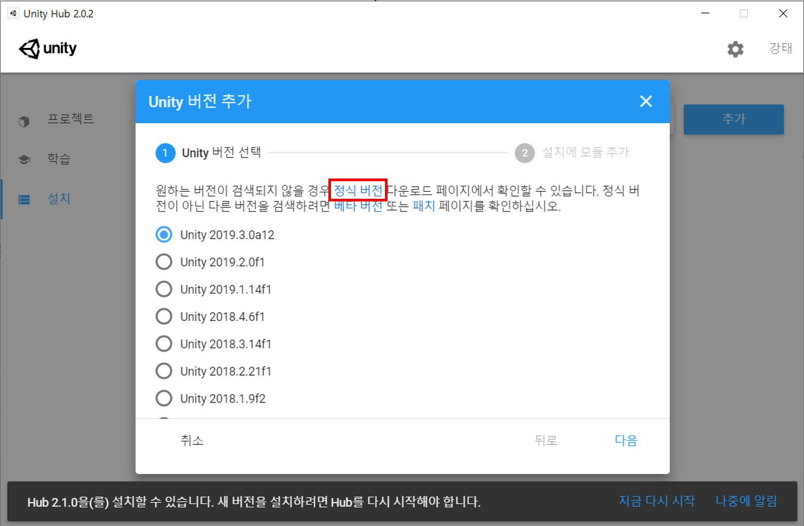
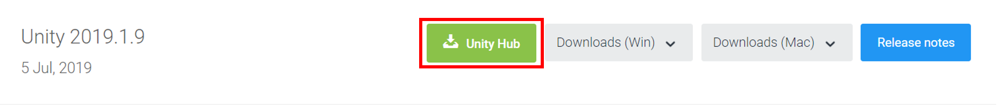
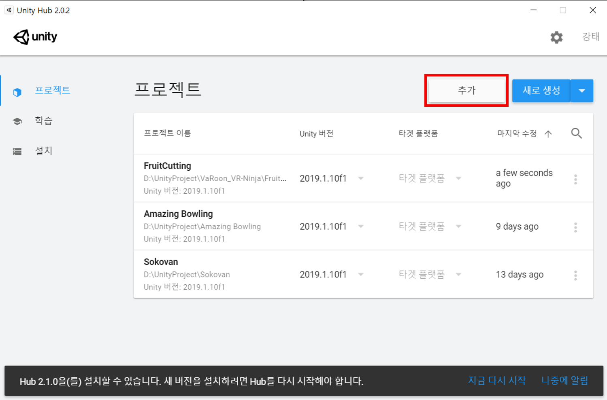
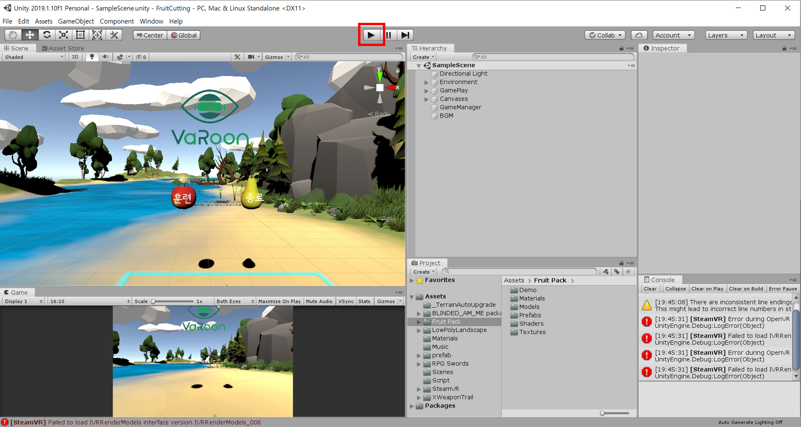
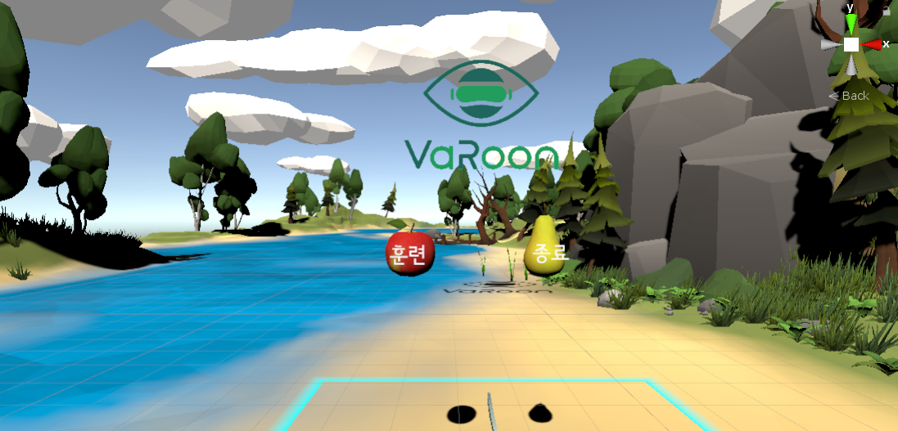
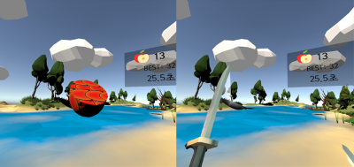

# Fruit Cutting VR Program

SW Maestro 10기 Tri_Catch 팀 **VaRoon** 프로젝트

사시, 기타 안근질환 환자들을 위한 재활 치료 VR 프로그램 입니다.

## 목표

양안에 오브제와 컨트롤러를 차별송출하거나(가상 프리즘 치료), 약시안의 화면을 약화시킴으로써(흐림 치료) **양안 협응 능력을 향상**시킬 수 있는 치료 프로그램을 구현한다.

## 개발 환경

Unity 2019.1.9

## 설치 방법

1. 프로젝트 다운로드

2. Unity Hub 설치

3. Unity Hub - 설치 -  추가 - 정식버전 클릭

   

4. Unity 2019.1.9 를 Unity Hub로 다운로드

   

## 실행 방법

1. Unity Hub - 프로젝트 - 추가 버튼으로 프로젝트 열기

   

2. VR 기기를 PC에 연결

3. 시작 버튼 클릭

   

### 시작 화면

메인 화면으로, 오브젝트를 컨트롤러로 썰면 "훈련" 또는 "종료"할 수 있다.

### 게임 화면

게임 화면으로, 좌안에 보이는 화면에는 오브젝트(과일)와 배경이, 우안에 보이는 화면에는 컨트롤러(칼)가 송출된다.

